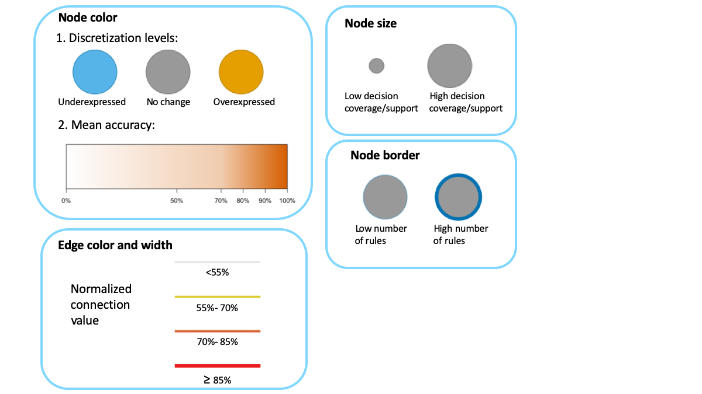

<center>
{width=30% }
</center>

***

VisuNet is an interactive tool for structural analysis of complex rule-based classifiers. VisuNet can be applied to any classification problem and is commonly used with complex health-related decision tasks. The rule networks produced can clearly identify driving genes (metabolites, methylation sites, etc) and their expression levels. VisuNet is implemented in R and uses the  [Shiny Gadgets](https://shiny.rstudio.com/articles/gadgets.html) attributes. The tool includes construction, filtration, visualization and customization of networks from rule-based models. VisuNet is available on  [GitHub](https://github.com/komorowskilab/VisuNet.git).


***
# Rule network construction


A rule network is constructed from sets of IF-THEN rules. In the network, nodes are conjuncts of rules, ie. features, and edges connect nodes with corresponding conjuncts in rules.

<center>
[  ](images/Rule-network_contruction2.png) 
The rule network resulting from a rule
</center>

***
# Installation
```{r, echo = FALSE, warning=FALSE, message=FALSE, results='asis'}
library(VisuNet)
```


```{r, echo = TRUE, fig.align='center', warning=FALSE, eval=FALSE}
devtools::install_github("komorowskilab/VisuNet")
```

***
# Example


This example uses gene expression data for young males with autism and control(@RN1). The rule-based classifier was created using [R.ROSETTA](https://github.com/komorowskilab/R.ROSETTA.git) [see @RN2].


```{r, echo = TRUE, fig.align='center', warning=FALSE, eval=FALSE}
require(VisuNet)

#Sample rule set for a classifier of young males with autism and control
#'Line by line' data type
autcon_ruleset

#Run VisuNet
#Remember to click DONE once you finish working on VisuNet
vis_out <- visunet(autcon_ruleset, type = 'L')
```


```{r, echo = FALSE, warning=FALSE, fig.cap='The sample rule network for the young males with autism and control classifier  from VisuNet (constructed for min decision coverage=27% and min accuracy=88%)'}
vis_out <- readRDS('data/visunet_out.RDS')
visNetwork(nodes = vis_out$nodes, edges = vis_out$edges, width = '100%') %>% 
  visLayout(randomSeed = 123) %>%
  visInteraction(hover = TRUE, navigationButtons = TRUE) %>%
  visOptions(selectedBy = list(variable = "group" , multiple = TRUE, main = "Select by decision", style = 'width: 200px; height: 30px;
                                                                padding-left: 80px;
                               font-size: 15px;
                               color: black;
                               border:none;
                               outline:none;'))
```

***
# Network legend

<center>
[ ](images/VisuNet_legend.png) 
The rule network legend
</center>

***
# References
